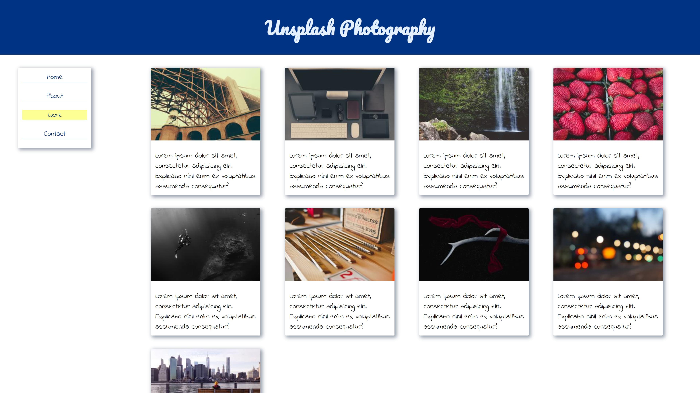

# Assignment 12: Use CSS Grid to Create a Webpage Layout

(**NOTE:** View a rendered version of this file in VS Code with `ctrl-shift-v` or `cmd-shift-v`)

&nbsp;

&nbsp;
## Background

This assignment is meant to familiarize you with CSS Grid, an advanced layout system within CSS.

&nbsp;
## Setup

Create a git repository titled `m12-hw12-lastname-firstname` and clone the repo to your computer. Copy the **contents** of the `unsolved` folder into your repository. Ensure the `index.html` file is in the **root** of your repository so that it deploys to GitHub pages properly.

&nbsp;
## Instructions

Use the provided code in the `unsolved` folder and modify the `style.css` file to match the mockups provided with these instructions. To receive full-credit for this assignment you must:

1. Make the `body` tag a CSS Grid container and apply column and row rules.
    * There are two columns and three rows on desktop screens, and one column and four rows on screens smaller than 1100 pixels.
    * Specify `grid-template-area` on the body tag to create specific columns and rows.
    * Specify `grid-area` on the `.header`, `.nav`, `.img_card__container`, and `.footer` elements.
    * You will have to redefine `grid-template-area` in the provided media query to change the grid to a single column with four rows.
1. Make the `.img_card__container` a grid container that auto-fills columns of image cards.
    * You will **NOT** use `grid-template-area` for this container. Instead, you will set guidelines for CSS grid to use and allow it to auto-create columns and rows.
    * You will need to use `grid-template-columns: repeat(auto-fill, minmax(300px,1fr))` to create the auto-sizing columns. [Read this article](https://css-tricks.com/auto-sizing-columns-css-grid-auto-fill-vs-auto-fit/) to understand why this works. [You can also see an example here](https://codepen.io/SaraSoueidan/pen/JrLdBQ).
    * You will need to set `grid-auto-rows` to `350px` to prevent the rows (and the image cards) from expanding vertically.
1. Ensure the site is responsive on desktop, tablet, and mobile screens.
1. Make your site as close to the provided mockups as possible.

&nbsp;
## Deployment

Your code must be deployed to GitHub Pages. To deploy a repository to GitHub pages you must:

1. Ensure your repository has an `index.html` file in the root directory.
1. Navigate to the `settings` section of the repository.
1. Click on `pages` in the left navigation menu.
1. Under `source` click the dropdown and select your `master` or `main` branch.
1. Click `save`.

Your site should be deployed to `<your github username>.github.io/<your repository name>` in 5-10 minutes.

&nbsp;
## Submission

Please submit both a link to your repository and a link to the live site. Also please include any comments on stumbling blocks or difficulties encountered while completing the assignment.

&nbsp;
## Resources

* [A Complete Guide to Grid on CSS-Tricks](https://css-tricks.com/snippets/css/complete-guide-grid/)
* [CSS Grid in 45min by Wes Bos](https://youtu.be/DCZdCKjnBCs)
* [CSS Grid Complete Course by Wes Bos](https://www.youtube.com/watch?v=T-slCsOrLcc&list=PLu8EoSxDXHP5CIFvt9-ze3IngcdAc2xKG&ab_channel=WesBos)
* [Auto-Sizing Columns in CSS Grid: `auto-fill` vs `auto-fit` on CSS-Tricks](https://css-tricks.com/auto-sizing-columns-css-grid-auto-fill-vs-auto-fit/)
* [CSS Grid `auto-fill` vs `auto-fit` example code](https://codepen.io/SaraSoueidan/pen/JrLdBQ)